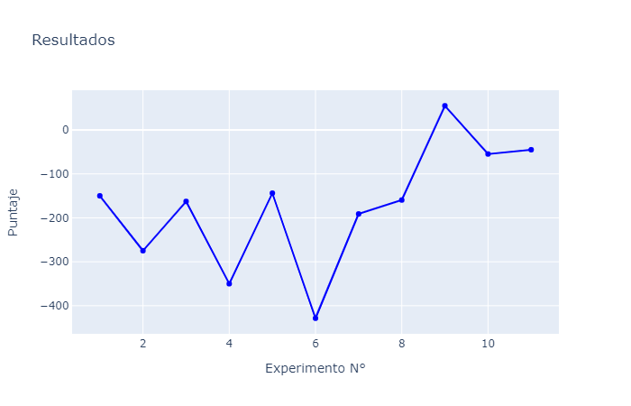
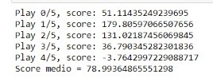
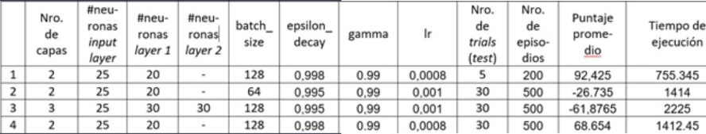

# DDQN-Lunar-Lander-v2
Aplicacion del algoritmo DDQN para el entorno de Open AI Lunar Lander

En el notebook DDQN Llander se muestra el codigo utlizado para los experimentos del proyecto. Asi mismo, en el archivo excel IA.xlsx se muestran los hiperparametros utlizados en cada experimento, asi como los resultados.

A continuacion se muestra una grafica con los resultados obtenidos hasta el momento (fecha 29/6/2020).

Integrantes:

* Joan Conza  [@jncnza](https://github.com/jncnza/)
* David Freidenson [@davfre98](https://github.com/davfre98)
* Ramfis Centeno  [@RamfisCenteno](https://github.com/RamfisCenteno/)

Actualizacion (16/7/2020):

Se siguio haciendo mas experimentos, de estos, se presentan los 2 mejores resultados:

En el primero, nos basamos en una implementacion para la resolucion del mismo problema, encontrado en https://github.com/psulkava/deep-reinforcement-learning-with-gym. De este repositorio se usaron los parámetros tales como: Learning Rate, Epsilon, Batch Size, Target Update. (El codigo de esta implementacion esta en: DDQN_LLander.ipynb, puede descargar los pesos de esta implementacion en Pesos_2518.h5)

Con estos parametros y en un entrenamiento de 7 horas se lograron los siguientes resultados (para 5 pruebas):

Para el segundo caso, se hace el replay en cada step para actualizar al learning model. El target model se actualiza una vez por época para mantener estabilidad. Los parametros y resultados obtenidos para este caso fueron: 

